  

  
  
  

---

## About

CS undergrad at **Dayananda Sagar College of Engineering** (B.E. Computer Science, 2024–2028), currently a **Junior Developer Intern at Xtrail** working on computer vision pipelines and small language model fine-tuning.

- Building vision systems, transformer models, and agentic AI workflows end to end
- Interested in the full stack of ML engineering: architecture, training efficiency, deployment
- 1st place out of 240 teams at the RNSIT 24-hour hackathon
- Reach me at **adarsh.pallavali@gmail.com**

---

## Tech Stack

**Languages**

  

**ML / AI**

  

`Transformer architecture` · `LoRA / QLoRA fine-tuning` · `RAG` · `BPE tokenization` · `Computer Vision` · `Agentic AI`

**Frameworks & Infrastructure**

  

`n8n` · `NumPy` · `Tailwind`

---

## Experience

### Junior Developer Intern — Xtrail
`Nov 2025 – Apr 2026` · Bangalore, India

- Developed and optimized computer vision workflows for real-world use cases, covering model training and evaluation
- Fine-tuned small language models with LoRA and QLoRA, improving performance while cutting training compute
- Built and deployed classification, detection, and automation models in production-level workflows
- Researched SLM training and RAG; findings were adopted by the team for subsequent model builds
- Designed a multi-agent stock trading system in n8n, orchestrating agents for historical analysis, past trade patterns, and earnings-call data into a master agent for automated execution

---

## Projects

### DevMatrix (DMX) — RNSIT Hackathon Winner
AI-powered developer environment diagnostics platform with an agentic remediation layer.

- Engineered the agentic AI layer on Groq (Llama 3) for autonomous environment-drift detection and safe, reversible shell-level fixes via a CLI
- Full-stack TypeScript monorepo: Node.js/Ink CLI, VS Code extension, and a Next.js 15 collaborative dashboard on Supabase

`TypeScript` `Next.js 15` `Groq` `Supabase` `Node.js`

### MiniGPT — Decoder-Only Language Model from Scratch
A GPT-style transformer implemented in PyTorch with no high-level model libraries.

- Causal self-attention, pre-norm blocks, and autoregressive decoding, trained on TinyStories
- Full pipeline: tiktoken BPE tokenization, `numpy.memmap` data loading, a custom `ChunkedRandomSampler`, Adam training loop, and greedy generation

`PyTorch` `tiktoken` `NumPy`

### PlantCare AI — Plant Diagnosis & Marketplace
Image-based plant disease detection with personalized 7-day care plans and a farmer marketplace.

- Disease classification from uploaded images, plant health tracking, and produce listings
- JWT auth via python-jose and bcrypt

`Next.js` `TypeScript` `Tailwind` `FastAPI` `MongoDB`

### AceAI — Predictive Analytics for Learning Personalization
ML system that identifies at-risk students and recommends personalized learning plans.

`Python` `scikit-learn` `Pandas`

---

## Achievements

| Award | Detail | Year |
| --- | --- | --- |
| RNSIT 24-Hour Hackathon — 1st Place | Ranked 1st of 240 teams with DevMatrix | 2025 |

---

## GitHub Stats

  
  

  

  

---

Always learning, always building.

